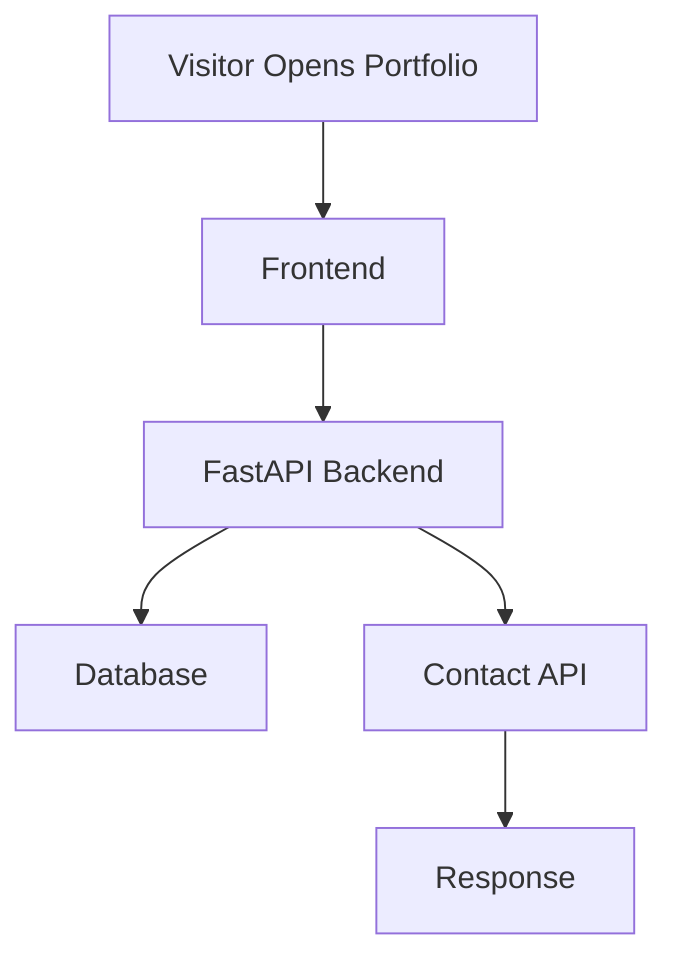

# 🚀 Ankit Verma — AI Engineer • Full-Stack Developer • Problem Solver

<div align="center">


<br/>

<a href="https://ankit-portfolio-frontend.onrender.com/" target="_blank">

</a>

<a href="https://github.com/">

</a>

<a href="mailto:av2322003@gmail.com">

</a>

<br/><br/>


</div>

---

# 🌌 Live Demo

## 🔗 Portfolio Website

### 🚀 [https://ankit-portfolio-frontend.onrender.com/](https://ankit-portfolio-frontend.onrender.com/)

---

# 🧠 About The Project

This portfolio is designed as a **production-grade developer platform** showcasing:

* ⚡ Full-stack engineering
* 🧠 AI/ML development
* ☁️ Cloud deployment
* 🔥 Backend API integration
* 📩 Contact form processing
* 🐳 Dockerized infrastructure

Built with a lightweight frontend and a scalable FastAPI backend architecture.

---

# ⚙️ Tech Stack

<div align="center">

| Frontend      | Backend    | Cloud         | DevOps         |
| ------------- | ---------- | ------------- | -------------- |
| HTML5         | FastAPI    | Render        | Docker         |
| CSS3          | Python     | Railway Ready | Docker Compose |
| JavaScript    | Uvicorn    | Netlify Ready | Gunicorn       |
| Responsive UI | SQLAlchemy | Vercel Ready  | Procfile       |

</div>

---

# 📂 Project Structure

```bash id="ztkgxj"
portfolio/
│
├── ankitportfolio.html
│
├── backend/
│   ├── main.py
│   └── requirements.txt
│
├── Dockerfile
├── docker-compose.yml
├── Procfile
├── .env.example
└── .gitignore
```

---

# ✨ Core Features

```diff id="cy0vri"
+ Modern Responsive Portfolio
+ FastAPI Backend Integration
+ Production Ready Deployment
+ Contact Form API
+ Docker Support
+ Cloud Deployment Compatible
+ Swagger Documentation
+ Optimized Lightweight Architecture
+ Secure Environment Variables
```

---

# 🚀 Local Setup

## Clone Repository

```bash id="wgvjlwm"
git clone https://github.com/your-username/portfolio.git
cd portfolio
```

---

# 🖥 Backend Setup

```bash id="9jx3k4"
cd backend

python -m venv venv
```

### ▶ Windows

```bash id="e1bj2n"
venv\Scripts\activate
```

### ▶ macOS/Linux

```bash id="o0hzuv"
source venv/bin/activate
```

### ▶ Install Dependencies

```bash id="hm6i2r"
pip install -r requirements.txt
```

### ▶ Run Server

```bash id="m2m5zw"
uvicorn main:app --reload --port 8000
```

---

# 🌐 API Documentation

| Endpoint | Description       |
| -------- | ----------------- |
| `/`      | Health Check      |
| `/docs`  | Swagger UI        |
| `/redoc` | API Documentation |

### Swagger URL

```bash id="r2lbhx"
http://localhost:8000/docs
```

---

# ☁️ Deployment

# 🟣 Render Deployment

## Build Command

```bash id="ow0pdx"
pip install -r backend/requirements.txt
```

## Start Command

```bash id="p8d8w2"
gunicorn backend.main:app \
--workers 2 \
--worker-class uvicorn.workers.UvicornWorker \
--bind 0.0.0.0:$PORT
```

---

# 🐳 Docker Deployment

```bash id="x11vtw"
docker compose up --build
```

---

# 🔐 Environment Variables

```env id="gpf93m"
DATABASE_URL=sqlite:///./portfolio.db
ALLOWED_ORIGINS=https://ankit-portfolio-frontend.onrender.com
DEBUG=false
```

---

# 📡 System Workflow



---

# 🧬 Engineering Highlights

<div align="center">

| Feature               | Benefit               |
| --------------------- | --------------------- |
| FastAPI Architecture  | High Performance APIs |
| Docker Support        | Easy Deployment       |
| Single Page Frontend  | Lightweight UX        |
| Cloud Ready           | Easy Scaling          |
| API Documentation     | Developer Friendly    |
| Environment Variables | Secure Configuration  |

</div>

---

# 📸 Live Preview

<div align="center">

<a href="https://ankit-portfolio-frontend.onrender.com/" target="_blank">


</a>

</div>

---

# 🤝 Connect With Me

<div align="center">

<a href="mailto:av2322003@gmail.com">

</a>

<a href="https://linkedin.com">

</a>

<a href="https://github.com">

</a>

</div>

---

<div align="center">

# ⭐ “Code. Create. Scale. Repeat.”


</div>
